# STM32-based joint control of a Neuronics Katana manipulator


Embedded robotics project for the custom control of a **Neuronics Katana 5M180** manipulator using an STM32 microcontroller, incremental encoder feedback, PWM actuation, PID joint control and MATLAB-based model identification.

The objective was to bypass the original internal joint controllers and develop a custom control stack for the manipulator joints. The project combines low-level firmware development, hardware reverse engineering, serial measurement acquisition, experimental dataset generation, and control-oriented system identification.

<p align="center">
  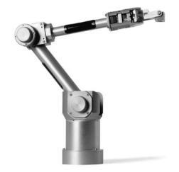
</p>

<p align="center">
  <em>Figure 1. Neuronics Katana 5M180 manipulator considered in the project.</em>
</p>

The final system was limited by hardware issues on the manipulator, especially encoder accessibility, electrical disturbances, and damaged encoder channels. For this reason, the repository should be read as an **embedded robotics prototyping and reverse-engineering project**, rather than as a fully validated production-ready robot controller.

---

## 1. Engineering objective

The project addresses the problem of implementing a custom motion-control architecture for a robotic manipulator whose original internal electronics were not suitable for direct reuse.

The main goals were:

- inspect the Katana hardware architecture, including motors, encoders, joints and original controllers;
- generate PWM actuation signals from STM32 timers;
- acquire incremental encoder signals through STM32 timer peripherals;
- estimate joint angular position from encoder ticks;
- implement a PID control law for each controlled joint;
- stream duty-cycle and angular-position measurements over serial communication;
- build experimental datasets for MATLAB model identification;
- evaluate ARX, nonlinear ARX and grey-box modeling strategies.

The closed-loop control objective can be summarized as:

```math
u_k = C(z) \left(q_{ref,k} - q_k\right)
```

where `q_ref` is the target joint angle, `q` is the measured joint angle estimated from encoder ticks, and `u_k` is the control command converted into PWM duty cycle and motor direction.

---

## 2. Hardware platform

### 2.1 STM32 microcontroller

The controller was implemented on an STM32 Nucleo platform based on the STM32F446 family. The board was selected because it provides the timer and communication peripherals required for this application:

- PWM generation for DC motor actuation;
- encoder-mode timers for incremental encoder acquisition;
- GPIO outputs for H-Bridge direction control;
- USART communication for telemetry and dataset collection;
- Cortex-M4 processing resources for embedded control.

<p align="center">
  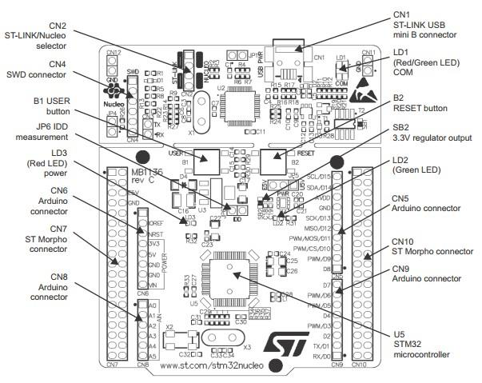
</p>

<p align="center">
  <em>Figure 2. STM32 Nucleo interfaces used as embedded-control platform.</em>
</p>

### 2.2 Motor driver

Motor actuation was implemented with an **L298N H-Bridge** driver. The STM32 provides the PWM signal on the enable input and uses two GPIO pins to select the motor direction.

<p align="center">
  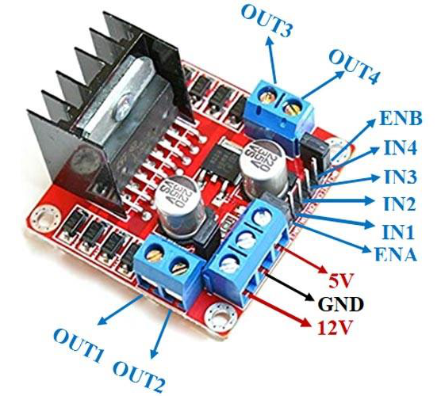
</p>

<p align="center">
  <em>Figure 3. L298N H-Bridge driver used for PWM-based motor actuation.</em>
</p>

| Input state | Motor behavior |
|---|---|
| `IN1 = LOW`, `IN2 = LOW` | Motor stopped |
| `IN1 = LOW`, `IN2 = HIGH` | Clockwise rotation |
| `IN1 = HIGH`, `IN2 = LOW` | Counter-clockwise rotation |
| `IN1 = HIGH`, `IN2 = HIGH` | Motor stopped |

### 2.3 Manipulator

The Katana manipulator is composed of four main revolute joints plus a gripper motor. The internal Katana master/slave controller architecture was not reused because of limited documentation, lack of reprogramming access, and suspected hardware malfunctions.

| Joint | Function | Motor | Transmission | Encoder |
|---|---|---|---|---|
| `M1` | Base rotation | Faulhaber 2657W024CR | Harmonic Drive | Faulhaber IE2-128 |
| `M2` | Shoulder lifting | Faulhaber 2342S012CR | Harmonic Drive | Faulhaber IE2-64 |
| `M3` | Elbow | Faulhaber 2342S012CR | Harmonic Drive | Faulhaber IE2-64 |
| `M4` | Forearm / wrist | Maxon 118400 | Planetary | Maxon 138061 |
| `M5` | Gripper | Maxon 118400 | Planetary | Maxon 138061 |

<p align="center">
  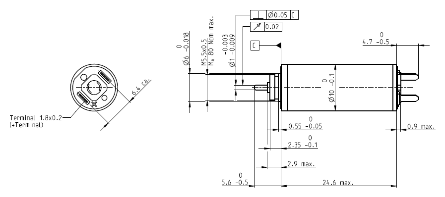
</p>

<p align="center">
  <em>Figure 4. Motor geometry used during the hardware analysis.</em>
</p>

---

## 3. Control architecture

The embedded control loop is based on the following chain.

<p align="center">
  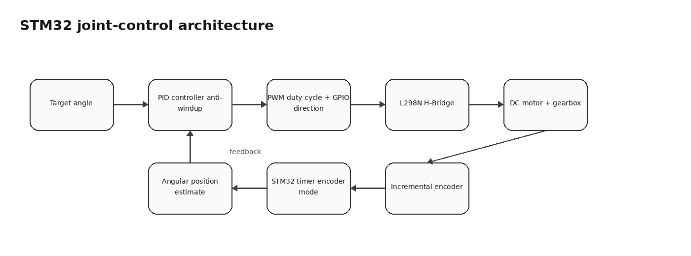
</p>

<p align="center">
  <em>Figure 5. Firmware-level joint-control architecture.</em>
</p>

At each control step:

1. the STM32 reads the encoder counter;
2. the encoder ticks are converted into angular position;
3. the PID controller computes the control action;
4. the command is saturated and converted into a PWM duty cycle;
5. GPIO pins select the motor direction through the H-Bridge;
6. telemetry is sent over serial communication for dataset acquisition.

The implemented controller uses a position error:

```math
e_k = q_{ref,k} - q_k
```

and computes the command from proportional, integral and derivative contributions. The integral term includes an anti-windup mechanism to avoid excessive accumulation under saturation.

---

## 4. Firmware implementation

The STM32 firmware is organized around modular C abstractions for motors and controllers.

### `motor.h`

Defines the `Motor_t` data structure and helper macros for:

- encoder initialization;
- angular-position estimation from ticks;
- clockwise and counter-clockwise rotation;
- motor stop command;
- duty-cycle update;
- angular-speed estimation.

The motor structure stores the current duty cycle, direction, encoder counter, target angle, angular position, previous angular position, speed estimate, timer register references, GPIO pins and encoder configuration.

### `pid.h` / `pid.c`

Define and implement the PID controller. The PID structure contains:

- proportional, integral and derivative gains;
- sampling time;
- current and previous error;
- derivative term;
- integral accumulator;
- saturation limits;
- anti-windup gain.

The controller is enabled only when the absolute position error is larger than `EPSILON = 5.0f`.

### `main.c`

Initializes the MCU and application peripherals:

- GPIO;
- DMA;
- PWM timers;
- encoder-mode timers;
- USART communication;
- periodic timer for the control loop.

The project uses STM32 HAL callbacks for encoder acquisition and periodic control. Encoder readings are handled in `HAL_TIM_IC_CaptureCallback`, while motor actuation and dataset-generation routines are scheduled inside `HAL_TIM_PeriodElapsedCallback`.

---

## 5. Measurement and identification workflow

The project also includes a measurement pipeline for system-identification experiments.

<p align="center">
  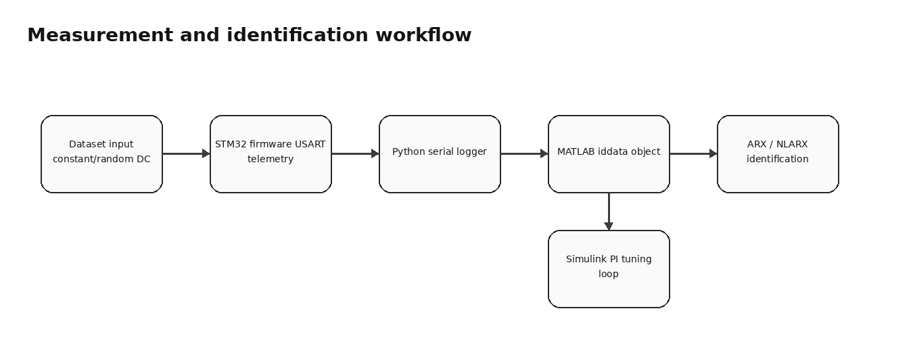
</p>

<p align="center">
  <em>Figure 6. Dataset generation and MATLAB identification workflow.</em>
</p>

The workflow is:

1. STM32 applies a selected duty-cycle profile to a motor.
2. The encoder-derived angular position and command data are sent over serial communication.
3. A Python script reads the serial stream and saves the measurements to text files.
4. MATLAB imports the collected data and creates `iddata` objects.
5. ARX, NLARX, ARMAX and grey-box identification experiments are performed.
6. Identified models are used for preliminary Simulink control-loop analysis.

The dataset-generation firmware supports different excitation modes:

- constant duty cycle;
- random duty cycle updated at every sampling time;
- random duty cycle held for a fixed interval, such as three seconds.

---

## 6. Model identification

The most relevant identification work focused on **Motor 2**, because the shoulder joint is strongly affected by gravity and therefore requires additional modeling and control considerations.

The identification dataset uses:

| Signal | Meaning |
|---|---|
| Input | Duty cycle applied to the driver, including rotation direction information |
| Output | Angular position of the joint |
| Additional measured quantity | Angular velocity estimate |

A detrending step was applied before model identification to improve the quality of the estimation.

<p align="center">
  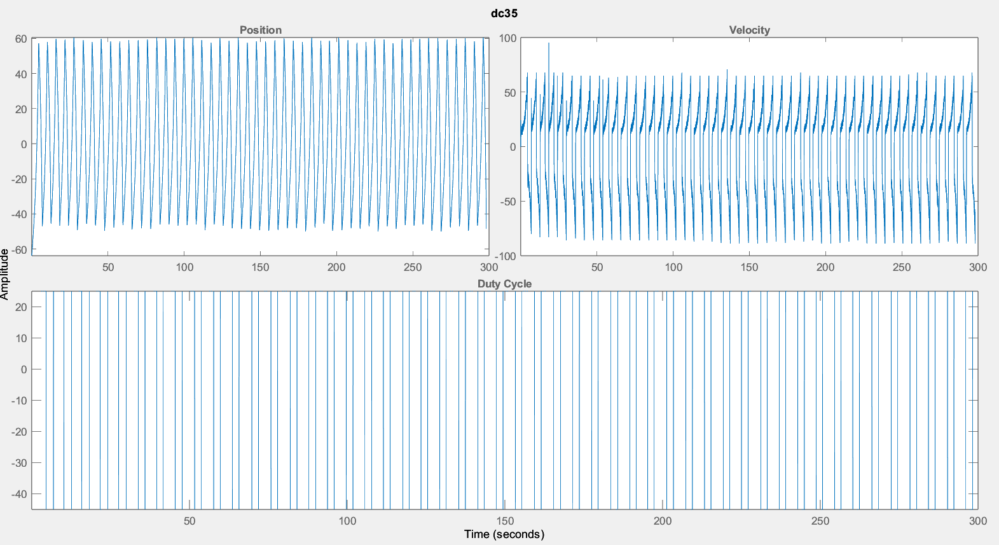
</p>

<p align="center">
  <em>Figure 7. Motor-2 dataset acquired with 35% duty cycle.</em>
</p>

### ARX and nonlinear ARX models

ARX and NLARX models were tested using MATLAB System Identification Toolbox.

<p align="center">
  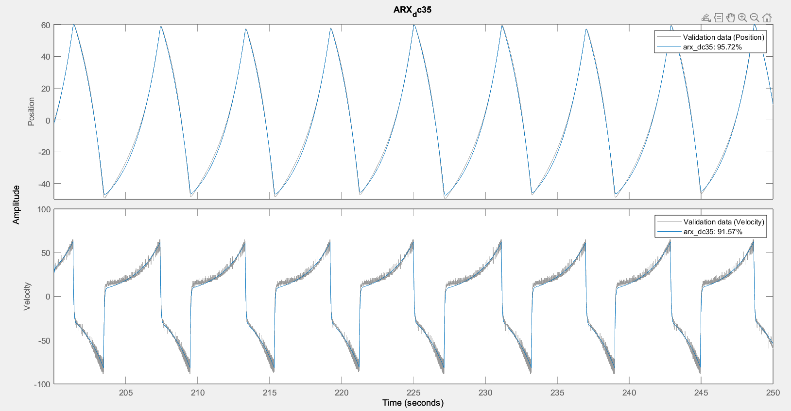
</p>

<p align="center">
  <em>Figure 8. ARX validation on the constant-duty-cycle dataset.</em>
</p>

<p align="center">
  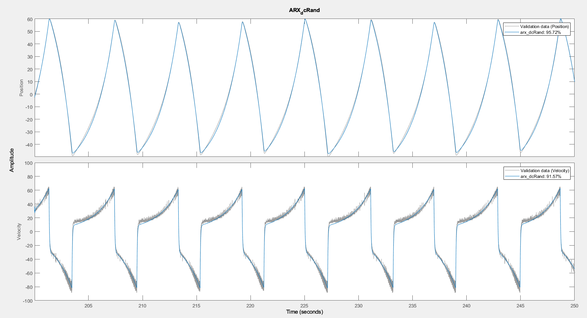
</p>

<p align="center">
  <em>Figure 9. ARX validation on a random-duty-cycle dataset.</em>
</p>

### Grey-box modeling

A grey-box identification strategy was also investigated. Two alternatives were considered:

1. model the complete manipulator using a known dynamic structure from a three-link robotic arm;
2. model a single joint using motor, gearbox and arm dynamics.

The complete-manipulator approach was limited by incomplete dynamic equations and by the fact that the acquired dataset was available only for the second joint. The single-link approach was more structurally compatible, but the available input was duty cycle, while the physical model required applied motor torque.

<p align="center">
  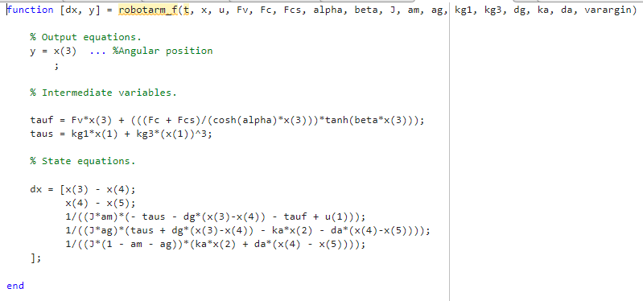
</p>

<p align="center">
  <em>Figure 10. MATLAB function for the investigated grey-box joint model.</em>
</p>

### Simulink control-oriented validation

An identified ARMAX model was inserted into a Simulink feedback loop for preliminary PI tuning. The loop includes a step reference, a discrete PI controller, a saturation block and the identified model.

<p align="center">
  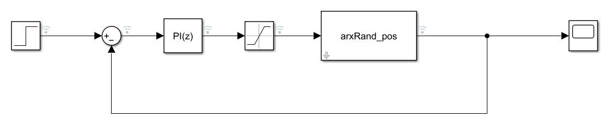
</p>

<p align="center">
  <em>Figure 11. Simulink loop used for preliminary PI-controller tuning.</em>
</p>

---

## 7. Hardware issues and engineering lessons

The project exposed several hardware-level limitations that prevented complete robot-level validation.

| Issue | Engineering impact | Attempted mitigation |
|---|---|---|
| Limited access to motor and encoder conductors | Full testing of all joints was not possible | Reverse engineering of accessible motor/encoder wiring |
| Motor 1 encoder damage | Encoder feedback became unavailable | Subsequent analysis focused on safer measurement strategies |
| Gravity load on Motor 2 | Shoulder joint required gravity-aware control | Motor-2 datasets were collected for identification |
| Motor 3 encoder disturbances | Encoder ticks were corrupted during actuation | Tested board separation, RC filters, capacitors and isolation strategies |
| Ground-loop and back-EMF effects | MCU counter readings were affected by electrical disturbances | Investigated filtering and mass decoupling approaches |
| Optocoupler and Schmitt-trigger approach | Isolation circuit was too slow for the 25 kHz PWM signal | Identified bandwidth limitation of the available components |
| Motor 2 encoder channel failure | Position measurement became unreliable | Considered model-based angular estimation and IMU support |

<p align="center">
  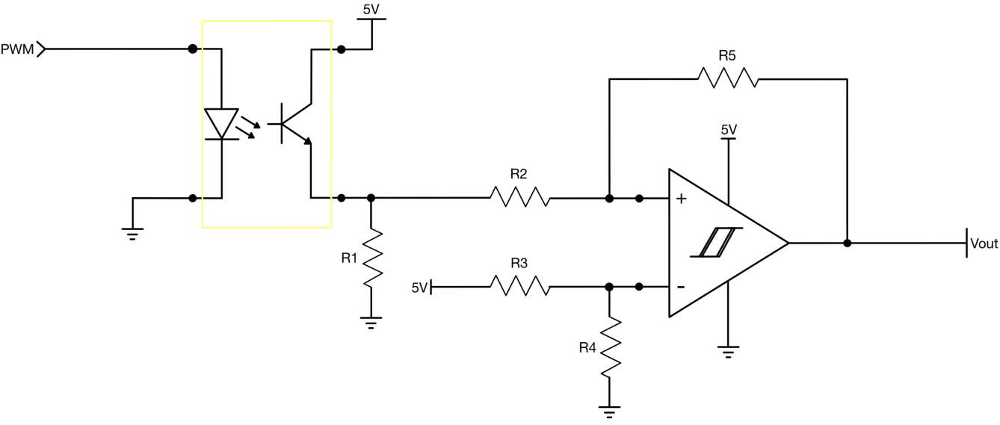
</p>

<p align="center">
  <em>Figure 12. Isolation circuit investigated for PWM/encoder disturbance mitigation.</em>
</p>

From an engineering perspective, the main outcome is not only the firmware and modeling pipeline, but also the characterization of practical limitations that must be addressed before a reliable joint controller can be deployed on the full manipulator.

---

## 8. Repository structure

```text
stm32-katana-joint-control/
├── C/
│   ├── Comunicazione tra due schede/
│   │   ├── JointControlKathana - attuazione/
│   │   └── JointControlKathana - misura encoder/
│   └── JointControlKathana - raccolta dataset/
├── Python/
│   └── Receive measure/
├── Matlab/
│   └── Model Identification/
├── Misure/
│   └── Motore 2/
├── assets/
│   ├── katana_5m180_manipulator.png
│   ├── stm32_nucleo_interfaces.png
│   ├── l298n_hbridge_driver.png
│   ├── motor_geometry.png
│   ├── joint_control_architecture.png
│   ├── measurement_identification_workflow.png
│   └── optoisolator_schmitt_trigger.png
├── results/
│   ├── motor2_dc35_dataset.png
│   ├── arx_validation_dc35.png
│   ├── arx_validation_random_dc.png
│   ├── grey_box_dynamic_model_function.png
│   ├── grey_box_estimation_script.png
│   ├── grey_box_parameter_setup.png
│   ├── simulink_pi_tuning_loop.png
│   ├── hardware_issues_summary.csv
│   ├── identification_summary.csv
│   └── results_summary.md
├── docs/
│   └── RELAZIONE_ROBOTICS.pdf
├── README.md
├── .gitignore
└── .gitattributes
```

---

## 9. Requirements

### Embedded firmware

- STM32CubeIDE;
- STM32CubeMX;
- STM32 HAL library;
- ARM GCC toolchain;
- ST-LINK debugger;
- STM32 Nucleo board based on STM32F446 family.

### Data acquisition

- Python 3;
- `pyserial`;
- serial connection to the STM32 board.

### Identification and simulation

- MATLAB;
- Simulink;
- System Identification Toolbox;
- Control System Toolbox, recommended for control analysis.

---

## 10. How to run

### Firmware

Open the selected STM32CubeIDE project inside the `C/` folder, build it using the desired configuration, and flash it to the STM32 Nucleo board through ST-LINK.

### Serial acquisition

Install Python dependencies and run the measurement receiver:

```powershell
cd "Python\Receive measure"
python -m venv .venv
.\.venv\Scripts\Activate.ps1
pip install pyserial
python receive_measure.py
```

The Python script reads serial data from the STM32 and writes the received measurements to a text file.

### MATLAB identification

Open MATLAB and run the identification scripts from:

```text
Matlab/Model Identification/
```

The scripts import collected measurements, build identification datasets and test ARX/NLARX/grey-box models.

---

## 11. Documentation

The full project report is available in:

```text
docs/RELAZIONE_ROBOTICS.pdf
```

The report includes hardware analysis, firmware implementation details, encoder and PWM testing, dataset collection, ARX/NLARX identification, grey-box modeling attempts, Simulink simulation and final considerations.

---

## 12. Future work

Possible extensions include:

- replace or externally mount reliable absolute/incremental encoders;
- add galvanic isolation with faster components suitable for the PWM and encoder bandwidths;
- integrate current sensing to estimate motor torque from electrical measurements;
- add an IMU-based angular-position measurement layer;
- redesign the motor-driver stage with protected encoder interfaces;
- identify a gravity-compensated model for the shoulder joint;
- validate the PID controller on multiple joints after solving the encoder reliability issues.

---

## 13. Authors

- Michele Abbaticchio
- Fabio Ceglie
- Nicolo Gentile
- Michele Perrelli
- Francesco Valenza

---

## 14. Academic context

Project developed for the **Robotics 1st Module - Industrial Handling** course.

MSc Automation Engineering  
Politecnico di Bari  
Academic year 2022/2023

---

## 15. License

This repository is intended for academic and portfolio purposes.
